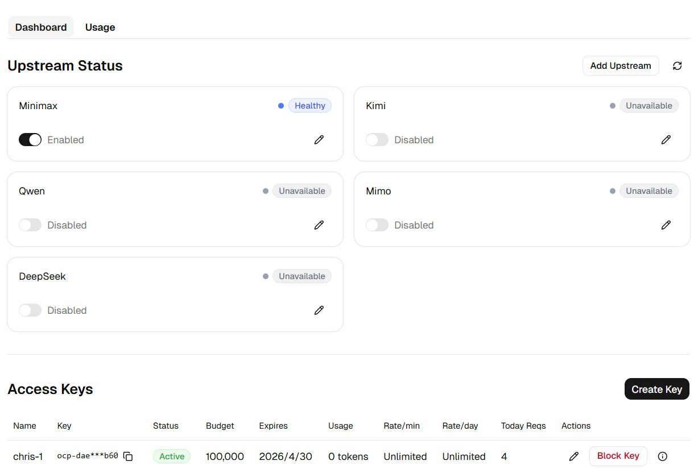

# one-codingplan (ocp)

[](https://golang.org)
[](./LICENSE)
[](https://github.com/ChrisZhangJin/one-codingplan)

ocp aggregates multiple AI coding plan credentials (Minimax, Kimi, Qwen, Mimo and others) behind a single OpenAI-compatible and Anthropic-compatible endpoint. Point your tools at one URL with one key — ocp handles routing, failover, and credit tracking transparently.

> Chinese version: [README_zh.md](./README_zh.md)



---

## Supported Providers

| Provider | Base URL | Notes |
|----------|----------|-------|
| Minimax | `https://api.minimaxi.com` | Model: `MiniMax-M2.5` |
| Mimo | `https://token-plan-cn.xiaomimimo.com` | Model: `mimo-v2-pro` |
| Kimi | `https://api.kimi.com/coding` | Requires `User-Agent: claude-code/1.0.0` |
| Qwen | `https://dashscope.aliyuncs.com` | Alibaba Cloud |
| DeepSeek | `https://api.deepseek.com` | Model: `deepseek-chat` |
| GLM | `https://open.bigmodel.cn` | Zhipu AI |

All providers are managed via the portal — no code changes needed to add or switch providers.

---

## Use with Claude Code / Codex

Point any OpenAI-compatible tool at ocp by setting two environment variables:

**Claude Code:**
```bash
export ANTHROPIC_BASE_URL=http://localhost:9189
export ANTHROPIC_API_KEY=ocp-<your-key>
claude
```

**Codex CLI:**
```bash
export OPENAI_BASE_URL=http://localhost:9189/v1
export OPENAI_API_KEY=ocp-<your-key>
codex
```

**Any OpenAI SDK client:**
```python
from openai import OpenAI

client = OpenAI(
    base_url="http://localhost:9189/v1",
    api_key="ocp-<your-key>",
)
```

ocp will automatically route to the next available provider if the current one runs out of credits or hits a rate limit.

---

## Quick Start

### 1. Configure

Copy and edit the config file:

```bash
cp config.yaml.example config.yaml
```

Key fields:

```yaml
server:
  port: 9189
  admin_key: "changeme123"   # portal & admin API password

database:
  path: "./ocp.db"

upstreams:
  - name: minimax
    base_url: https://api.minimaxi.com/anthropic
    api_key: "sk-..."
    enabled: true
```

### 2. Build & Run

```bash
make build
OCP_ENCRYPTION_KEY=<16-char-secret> ./ocp --config config.yaml
```

`OCP_ENCRYPTION_KEY` encrypts upstream API keys stored in the database. Must be exactly 16, 24, or 32 characters.

### 3. Open Portal

Visit **http://localhost:9189** and sign in with your `admin_key`.

---

## Admin API

All admin endpoints require `Authorization: Bearer <admin_key>`.

### Upstreams

```bash
# List all upstreams with health status
curl http://localhost:9189/api/upstreams \
  -H "Authorization: Bearer changeme123"

# Toggle an upstream enabled/disabled (use id from list)
curl -X POST http://localhost:9189/api/upstreams/1/toggle \
  -H "Authorization: Bearer changeme123"

# Rotate to next available upstream
curl -X POST http://localhost:9189/api/upstreams/rotate \
  -H "Authorization: Bearer changeme123"
```

### Access Keys

```bash
# List all keys
curl http://localhost:9189/api/keys \
  -H "Authorization: Bearer changeme123"

# Create a key
curl -X POST http://localhost:9189/api/keys \
  -H "Authorization: Bearer changeme123" \
  -H "Content-Type: application/json" \
  -d '{"name": "my-key", "token_budget": 1000000, "rate_limit_per_minute": 60}'

# Block a key
curl -X POST http://localhost:9189/api/keys/<id>/block \
  -H "Authorization: Bearer changeme123"

# Unblock a key
curl -X POST http://localhost:9189/api/keys/<id>/unblock \
  -H "Authorization: Bearer changeme123"
```

### Proxy API (using an access key)

```bash
# OpenAI-compatible
curl http://localhost:9189/v1/chat/completions \
  -H "Authorization: Bearer ocp-<your-key>" \
  -H "Content-Type: application/json" \
  -d '{
    "model": "claude-sonnet-4-5",
    "messages": [{"role": "user", "content": "say hi"}]
  }'

# Anthropic-compatible
curl http://localhost:9189/v1/messages \
  -H "Authorization: Bearer ocp-<your-key>" \
  -H "Content-Type: application/json" \
  -d '{
    "model": "claude-sonnet-4-5",
    "max_tokens": 256,
    "messages": [{"role": "user", "content": "say hi"}]
  }'
```

---

## Database Initialization

ocp uses SQLite and creates the schema automatically via GORM `AutoMigrate` on first startup. No manual setup is required for a fresh deployment.

If you prefer to initialize the database manually (e.g. for a clean environment or CI), use the provided `init.sql`:

```bash
sqlite3 ocp.db < init.sql
```

`init.sql` includes:
- Full table and index definitions (`CREATE TABLE IF NOT EXISTS`, `CREATE INDEX IF NOT EXISTS`)
- Seed rows for all supported upstream providers with blank API keys

After initializing, set real API keys via the portal (**Upstream Status → Edit**) or the admin API:

```bash
curl -X PATCH http://localhost:9189/api/upstreams/<id> \
  -H "Authorization: Bearer changeme123" \
  -H "Content-Type: application/json" \
  -d '{"api_key": "your-real-key"}'
```

> **Note:** Re-running `init.sql` on an existing database is safe — all inserts use `INSERT OR IGNORE`.

---

## Access Key Error Codes

| Situation | HTTP Status | Error |
|-----------|-------------|-------|
| Missing or unknown token | 401 Unauthorized | `unauthorized` |
| Key disabled / blocked | 403 Forbidden | `key disabled` |
| Key expired | 403 Forbidden | `key expired` |
| Token budget exceeded | 429 Too Many Requests | `token budget exceeded` |
| Per-minute rate limit exceeded | 429 Too Many Requests | `per-minute rate limit exceeded` |
| Per-day rate limit exceeded | 429 Too Many Requests | `per-day rate limit exceeded` |

---

## Database Schema

SQLite file at the path configured in `database.path` (default: `./ocp.db`).

### `upstreams`

| Column | Type | Description |
|--------|------|-------------|
| `id` | INTEGER | Primary key |
| `name` | TEXT | Provider name (e.g. `minimax`, `kimi`) |
| `base_url` | TEXT | Provider API base URL |
| `api_key_enc` | BLOB | Encrypted API key |
| `enabled` | BOOLEAN | Whether this upstream is active in the pool |
| `available` | BOOLEAN | Runtime health — false during cooldown/circuit-open |
| `model_override` | TEXT | Force a specific model name for this upstream; empty = pass through |
| `created_at` | DATETIME | |
| `updated_at` | DATETIME | |

```bash
sqlite3 ocp.db "SELECT id, name, enabled, model_override FROM upstreams;"
```

### `access_keys`

| Column | Type | Description |
|--------|------|-------------|
| `id` | TEXT (UUID) | Primary key |
| `name` | TEXT | Human-readable label |
| `token` | TEXT | Bearer token sent by clients (`ocp-...`) |
| `enabled` | BOOLEAN | false = blocked, rejects all requests |
| `token_budget` | INTEGER | Max tokens allowed (0 = unlimited) |
| `rate_limit_per_minute` | INTEGER | Per-minute request cap (0 = unlimited) |
| `rate_limit_per_day` | INTEGER | Per-day request cap (0 = unlimited) |
| `allowed_upstreams` | TEXT | JSON array of upstream names; empty = all |
| `expires_at` | DATETIME | Nullable expiry |
| `created_at` | DATETIME | |
| `updated_at` | DATETIME | |

```bash
sqlite3 ocp.db "SELECT name, token, enabled FROM access_keys;"
```

### `usage_records`

| Column | Type | Description |
|--------|------|-------------|
| `id` | INTEGER | Primary key |
| `created_at` | DATETIME | Indexed — use for time-range queries |
| `key_id` | TEXT | References `access_keys.id` |
| `upstream_id` | INTEGER | References `upstreams.id` |
| `upstream_name` | TEXT | Provider name at time of request |
| `input_tokens` | INTEGER | |
| `output_tokens` | INTEGER | |
| `latency_ms` | INTEGER | End-to-end request latency |
| `success` | BOOLEAN | false if upstream returned an error |

```bash
sqlite3 ocp.db "SELECT upstream_name, SUM(input_tokens+output_tokens) FROM usage_records GROUP BY upstream_name;"
```

---

## License

MIT © 2026 Chris Zhang — see [LICENSE](./LICENSE)
